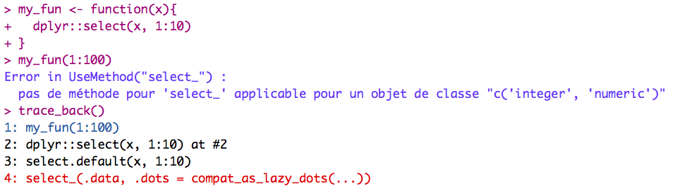

<!-- README.md is generated from README.Rmd. Please edit that file -->
[](https://img.shields.io/badge/lifecycle-experimental-orange.svg)

debugin
=======

Developpers debug. A lot. One way to do it in R is to wrap your
functions in `debug()`, and run it again. And then we have `debug()` it,
and need to `undebug()` them. Or we can also call `debugonce()`.

Debug functions
---------------

Developpers like to be efficient. Writing debug and undebug can break
your workflow. So why not doing it with a keyboard shortcut?

That’s what `{debugin}` does: you highlight a function in your RStudio
windows, and the addin does the job of `debug()`, `undebug()`, or
`debugonce()`.

> Note: using debugin is better with keyboard shortcuts

The addin allows :

-   `debug()`
-   `debugonce()`
-   `undebug()`

Debug with message
------------------

You can access the debug\_with\_messages utils functions:

``` r
library(debugin)
a <- function() "plop"
debug_with_message(a)
#> a is now on debug mode
undebug_with_message(a)
#> a is no longer on debug mode
```

Comparing to base function, these functions does nothing more than
printing a message to the user. Hence the use of an addin.

trace\_back
-----------

With base R, the traceback is printed in reverse order (from the last
call to the first). With `trace_back()`, you get the call stack in the
order the calls were made. Plus, the first call is printed in blue, and
the call causing the error in printed in red (if your R session support
ANSI colors).

``` r
my_fun <- function(x){
  dplyr::select(x, 1:10)
}
my_fun(1:100)
trace_back()
```



Please note that this project is released with a [Contributor Code of
Conduct](CONDUCT.md). By participating in this project you agree to
abide by its terms.
